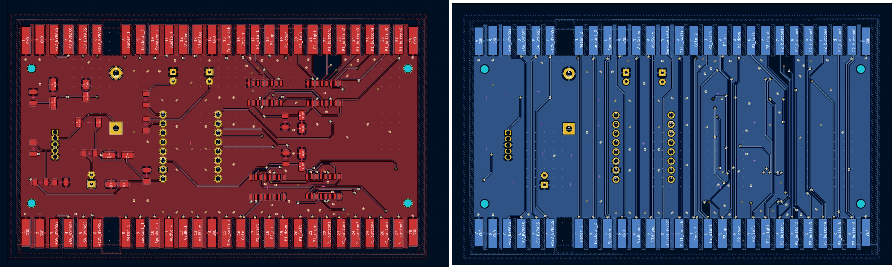

# Arcade Bluetooth Controller Adapter "BlueJamma"

## Overview
This project provides a hardware and software solution to add Bluetooth gamepad support to Jamma/Chamma arcade boards (like Pandora Box), while maintaining the original physical controls functionality. The adapter allows connecting up to 2 Bluetooth gamepads simultaneously with the existing control panel.

The device is built around the ESP32-C3 SuperMini development board, which provides an excellent balance of size, features, and cost. The control program is based on the BluePad32 library and can be found in the `sketch` folder of this repository.

## Features
- Supports up to 2 Bluetooth gamepads simultaneously
- Maintains original control panel functionality
- Compatible with Jamma/Chamma arcade boards
- Easy installation and setup
- Open-source hardware and software

## Hardware
The project uses the ESP32-C3 SuperMini form factor for its compact size and built-in USB capabilities. A complete list of required components and materials can be found in the interactive [Bill of Materials](bom/ibom.html).

The PCB design incorporates elements from the [JammaKludge project](https://github.com/estechnical/jammakludge) by estechnical, which provided valuable reference for the Jamma connector implementation.

## Demonstration

### PCB Design

### Enclosure Design
Check out the 3D render of the enclosure design:
https://github.com/KPEKEP/BlueJamma/raw/main/enclosure/export/rc3/rc3_v1.avi

STEP files for the enclosure are available in the [enclosure/export/rc3/](enclosure/export/rc3/) folder.

### Assembled Device

Assembled device: https://github.com/KPEKEP/BlueJamma/raw/main/images/assembled.MOV

Watch a demo of the device working with Bluetooth controllers:
https://github.com/KPEKEP/BlueJamma/raw/main/images/demo.mp4

## TODO
* Add a shadow-line for the top and bottom parts of the enclosure

## Disclaimer and License

### Non-Commercial Use License
This project is released under a Non-Commercial Use License. You are free to:
- Use this project for personal, non-commercial purposes
- Modify and adapt the code for personal use
- Share the project with others, provided you maintain the same license

You may NOT:
- Use this project for commercial purposes
- Sell products based on this project
- Include this project in commercial applications

### Chamma and Jamma compatibility
IMPORTANT: The additional kicker harnesses are not supported yet.
BlueJamma was designed to be a pass-through between the arcade board and physical controls or whatever is connected next. When no input is coming from gamepads, regardless of their connection status, the system behaves as it would be a straight connection between the arcade board and physical controllers.
If an arcade board has Chamma (6-button), or regular Jamma (non-6-button) interface, it should work.
Please refer to the image of the layout below (side by side of top and bottom side of the PCB) and pay attention to the traces between 25,26,27,C,D,E on the right side of the PCB.

### Risk Disclaimer
### ATTENTION: The device was tested only with Pandora Box, which is a Chamma board. Jamma boards are not tested yet.

**USE AT YOUR OWN RISK**: The hardware and software in this project are provided "as is", without warranty of any kind, express or implied. The creators and contributors of this project accept no responsibility or liability for any damage, injury, or loss resulting from the use of this project's hardware, software, or documentation.

- We are not responsible for any damage to your arcade board, control panel, or other equipment
- Modify your hardware at your own risk
- Always verify connections and power requirements before use

### Components Attribution
This project uses:
- Open-source libraries and components, all properly credited in the source code
- Originally written code and hardware designs
- Third-party libraries used under their respective licenses (see Dependencies section)

## Contributing
Contributions are welcome! Please read our contributing guidelines before submitting pull requests.

## Support
This is a community project. For support:
- Open an issue on GitHub
- Check existing documentation
- Join our community discussions

## Authors and Acknowledgment
Pavel Nakaznenko, 2025

This project relies on and gratefully acknowledges the following tools and projects:

- [BluePad32](https://github.com/ricardoquesada/bluepad32) - The excellent Bluetooth gamepad support library that powers the controller functionality
- [ESP32-C3](https://www.espressif.com/en/products/socs/esp32-c3) - The RISC-V based microcontroller from Espressif
- [Arduino IDE](https://www.arduino.cc/en/software) - The development environment used for programming
- [KiCad](https://www.kicad.org/) - The open-source software used for electronic design
- [JLCPCB](https://jlcpcb.com/) - PCB manufacturing and assembly services
- [JammaKludge](https://github.com/estechnical/jammakludge) - Reference materials for Jamma connector implementation

Special thanks to all the open-source contributors and communities behind these projects.

---

Remember: This project is for non-commercial use only. All modifications and usage are at your own risk. 

LICENSE: [CC BY-NC-SA 4.0](https://creativecommons.org/licenses/by-nc-sa/4.0/)